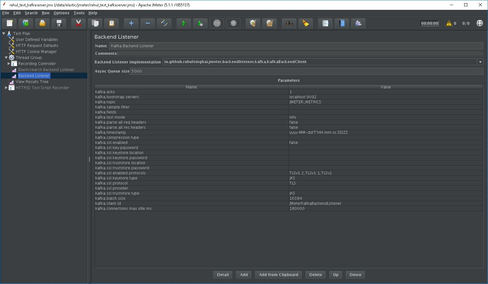

# jmeter-backend-listener-kafka

[](https://app.codacy.com/app/rahulsinghai/jmeter-backend-listener-kafka?utm_source=github.com&utm_medium=referral&utm_content=rahulsinghai/jmeter-backend-listener-kafka&utm_campaign=Badge_Grade_Dashboard)
[](https://codecov.io/gh/rahulsinghai/jmeter-backend-listener-kafka)
[](https://travis-ci.org/rahulsinghai/jmeter-backend-listener-kafka)

A JMeter plug-in that enables you to send test results to a Kafka server.

# Overview

### Description
JMeter Backend Listener Kafka is a JMeter plugin enabling you to send test results to a Kafka server.
It is inspired from JMeter [ElasticSearch](https://github.com/delirius325/jmeter-elasticsearch-backend-listener) backend listener plug-in.

### Features

* Filters
  * Only send the samples you want, by using Filters! Simply type them as follows in the appropriate field: ``filter1;filter2;filter3`` or ``sampleLabel_must_contain_this``.
* Specific fields `field1;field2;field3`
  * Specify fields that you want to send to Kafka (possible fields below):
     * AllThreads
     * BodySize
     * Bytes
     * SentBytes
     * ConnectTime
     * ContentType
     * DataType
     * ErrorCount
     * GrpThreads
     * IdleTime
     * Latency
     * ResponseTime
     * SampleCount
     * SampleLabel
     * ThreadName
     * URL
     * ResponseCode
     * TestStartTime
     * SampleStartTime
     * SampleEndTime
     * Timestamp
     * InjectorHostname
* Verbose, semi-verbose, error only, and quiet mode:
  * __debug__ : Send request/response information of all samplers (headers, body, etc.)
  * __info__ : Sends all samplers to the Kafka server, but only sends the headers, body info for the failed samplers.
  * __quiet__ : Only sends the response time, bytes, and other metrics
  * __error__ : Only sends the failing samplers to the Kafka server (Along with their headers and body information).
* Use Logstash/NiFi or any other tool to consume data from Kafka topic and then ingest it into a Database of your liking.

### Maven dependency

```xml
<dependency>
  <groupId>io.github.rahulsinghai</groupId>
  <artifactId>jmeter.backendlistener.kafka</artifactId>
  <version>1.0.0-SNAPSHOT</version>
</dependency>
```

### Installing JMeter

- SSH to a Unix machine with X-11 Forwarding enabled, and then set DISPLAY variable:

  ```bash
  export DISPLAY=Your_terminal_IP:0.0
  ```

- Download [JMeter](https://jmeter.apache.org/download_jmeter.cgi) binary and extract it:
  
  ```bash
  mkdir -P /home/jmeter
  cd /home/jmeter
  curl -O -k http://mirror.vorboss.net/apache//jmeter/binaries/apache-jmeter-5.1.1.tgz
  tar -zxvf apache-jmeter-5.1.1.tgz
  ln -s apache-jmeter-5.1.1 ./current
  export JMETER_HOME=/data/elastic/jmeter/current
  ```

- Download and install [Plugin Manager](https://jmeter-plugins.org/wiki/PluginsManager/) to `lib/ext` folder:

  ```bash
  curl -O -k http://search.maven.org/remotecontent?filepath=kg/apc/jmeter-plugins-manager/1.3/jmeter-plugins-manager-1.3.jar
  mv jmeter-plugins-manager-1.3.jar apache-jmeter-5.1.1/lib/ext/
  ```
  
  Detailed instructions on installing Plug-ins Manager are available at this [blog](https://octoperf.com/blog/2018/04/04/jmeter-plugins-install/).

- Start JMeter:

  ```bash
  cd $JMETER_HOME
  JVM_ARGS="-Dhttps.proxyHost=myproxy.com -Dhttps.proxyPort=8080 -Dhttp.proxyUser=user -Dhttp.proxyPass=***" ./bin/jmeter.sh
  ```

### Packaging and testing your newly added code

- Build the artefact: Execute below mvn command. Make sure JAVA_HOME is set properly

  ```bash
  mvn clean package
  ```

- Move the resulting JAR to your `JMETER_HOME/lib/ext`.

  ```bash
  mv target/jmeter.backendlistener.kafka-1.0.0-SNAPSHOT.jar $JMETER_HOME/lib/ext/
  ```

- Restart JMeter
- Go to Options > Plugins Manager
- You will find Kafka Backend listener plug-in mentioned in the Installed plug-ins tab.

### Configuring jmeter-backend-listener-kafka plug-in

- In your **Test Pan**, right click on **Thread Group** > Add > Listener > Backend Listener
- Specify parameters as shown in image below (**bootstrap.servers** and **kafka.topic** are mandatory ones): 



## Screenshots

### Sample Grafana dashboard


### For more info

For more information, here's a little [documentation](https://github.com/rahulsinghai/jmeter-backend-listener-kafka/wiki).

## Contributing

Feel free to contribute by branching and making pull requests, or simply by suggesting ideas through the "Issues" tab.

### Code Styling

- Please find instructions [here](https://github.com/HPI-Information-Systems/Metanome/wiki/Installing-the-google-styleguide-settings-in-intellij-and-eclipse) on how to configure your IntelliJ or Eclipse to format the source code according to Google style.
  Once configured in IntelliJ, format code as normal with `Ctrl + Alt + L`.
  
  Adding the XML file alone and auto-formatting the whole document could replace imports with wildcard imports, which isn't always what we want.
  
  - To stop this from happening, Go to `File` → `Settings` → `Editor` → `Code Style` → `Java` and select the `Imports` tab.
  - Set `Class Count to use import with '*'` and `Names count to us static import with '*'` to a higher value; anything over `999` should be fine.
  
  You can now reformat code throughout your project without imports being changed to Wildcard imports.

- You also need to use `maven-git-code-format` plugin in `pom.xml` to auto format the code according to Google code style before any Git commit.
